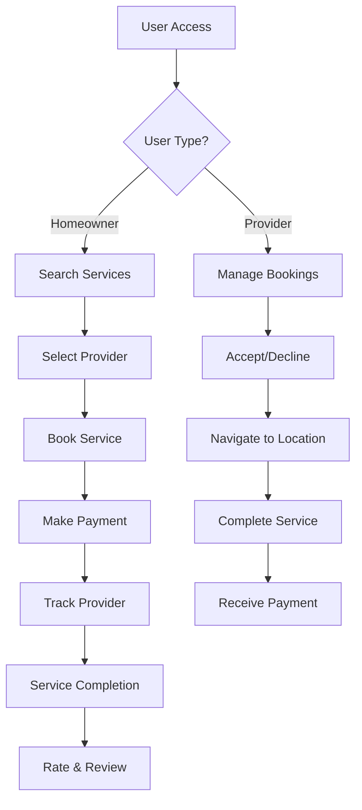

# 🏠 ShebaBondhu

<div align="center">
  
</div>

<br/>

**ShebaBondhu** is a comprehensive home services management platform designed to bridge the gap between homeowners and trusted service providers across Bangladesh. From finding skilled electricians and plumbers to booking regular cleaning packages, experience seamless household service delivery with modern technology and user-centric design.

## 📑 Table of Contents

- [🚀 Tools & Technologies](#-tools--technologies)
- [📋 Project Management](#-project-management)
- [🏗️ Project Status](#️-project-status)
- [🌐 Live Demo](#-live-demo)
- [👥 Team Members](#-team-members)
- [📘 Documentation](#-documentation)
- [💻 Tech Stack](#-tech-stack)
- [📜 Project Description](#-project-description)
- [🛠️ Getting Started](#️-getting-started)
- [🗺️ System Architecture](#️-system-architecture)
- [📊 Database Models](#-database-models)

## 🚀 Tools & Technologies

<p align="center">
  
  
  
  
  
  <br/>
  
  
  
  
  
</p>

## 📋 Project Management

[](https://github.com/rupontinova/ShebaBondhu)
[](https://trello.com/b/0ImvND4c/shebabondhu)
[](https://discord.com)

## 🏗️ Project Status


## 🌐 Live Demo

Coming Soon...

## 👥 Team Members

<div align="center">

<table style="width: 100%;">
  <tr>
    <td align="center" width="20%">
      <h4>Nafisa Anzum Kotha</h4>
      
      <br><p><strong>ID:</strong> 2154901047</p>
    </td>
    <td align="center" width="20%">
      <h4>Jawad Anzum Fahim</h4>
      
      <br><p><strong>ID:</strong> 2254901022</p>
    </td>
    <td align="center" width="20%">
      <h4>Ruponti Muin Nova</h4>
      
      <br><p><strong>ID:</strong> 2254901048</p>
    </td>
    <td align="center" width="20%">
      <h4>Sadia Alam</h4>
      
      <br><p><strong>ID:</strong> 2254901048</p>
    </td>
    <td align="center" width="20%">
      <h4>Muttakin Mahmud</h4>
      
      <br><p><strong>ID:</strong> 2254901120</p>
    </td>
  </tr>
</table>

</div>

## 📘 Documentation

Comprehensive documentation is available including:

- **Software Requirements Specification (SRS)**: Complete system requirements and specifications
- **Use Case Diagrams**: Visual representation of user interactions
- **Database Schema**: Detailed database structure and relationships
- **System Flow Diagrams**: Process flow and system architecture
- **Coding Standards**: Airbnb JavaScript Style Guide compliance
- **API Documentation**: JSDoc-generated code documentation
- **UI/UX Designs**: Figma prototypes and mockups

View full documentation in the [`resources/`](https://github.com/rupontinova/ShebaBondhu/tree/main/resources) directory.

## 💻 Tech Stack

<table>
  <tr>
    <th colspan="2">Frontend</th>
  </tr>
  <tr>
    <td><strong>Next.js (App Router)</strong></td>
    <td>React framework with server-side rendering and optimized routing</td>
  </tr>
  <tr>
    <td><strong>JavaScript (ES6+)</strong></td>
    <td>Modern JavaScript for dynamic and interactive user interfaces</td>
  </tr>
  <tr>
    <td><strong>React</strong></td>
    <td>Component-based UI library for building responsive interfaces</td>
  </tr>
  <tr>
    <td><strong>Tailwind CSS</strong></td>
    <td>Utility-first CSS framework for modern, responsive design</td>
  </tr>
  <tr>
    <td><strong>Framer Motion</strong></td>
    <td>Animation library for smooth and interactive UI animations</td>
  </tr>
  <tr>
    <th colspan="2">Backend</th>
  </tr>
  <tr>
    <td><strong>Next.js API Routes</strong></td>
    <td>Serverless functions for building RESTful APIs</td>
  </tr>
  <tr>
    <td><strong>MongoDB</strong></td>
    <td>NoSQL database for scalable document storage</td>
  </tr>
  <tr>
    <td><strong>Mongoose</strong></td>
    <td>ODM library for MongoDB with schema validation</td>
  </tr>
  <tr>
    <th colspan="2">Maps & Location</th>
  </tr>
  <tr>
    <td><strong>Google Maps API</strong></td>
    <td>Real-time location tracking and geolocation services</td>
  </tr>
  <tr>
    <td><strong>Geocoding API</strong></td>
    <td>Address validation and coordinate conversion</td>
  </tr>
  <tr>
    <th colspan="2">Authentication & Security</th>
  </tr>
  <tr>
    <td><strong>NextAuth.js</strong></td>
    <td>Authentication library with Google OAuth support</td>
  </tr>
  <tr>
    <td><strong>JWT</strong></td>
    <td>JSON Web Tokens for secure session management</td>
  </tr>
  <tr>
    <td><strong>bcryptjs</strong></td>
    <td>Password hashing for secure user authentication</td>
  </tr>
  <tr>
    <td><strong>OTP Verification</strong></td>
    <td>Two-factor authentication for enhanced security</td>
  </tr>
  <tr>
    <th colspan="2">Payment Integration</th>
  </tr>
  <tr>
    <td><strong>bKash / Nagad / Rocket</strong></td>
    <td>Local payment gateway integration for Bangladesh</td>
  </tr>
  <tr>
    <th colspan="2">Development & Quality</th>
  </tr>
  <tr>
    <td><strong>ESLint (Airbnb Config)</strong></td>
    <td>Code linting and style enforcement</td>
  </tr>
  <tr>
    <td><strong>JSDoc</strong></td>
    <td>Automated documentation generation for JavaScript code</td>
  </tr>
  <tr>
    <td><strong>Jest</strong></td>
    <td>Unit testing framework for JavaScript applications</td>
  </tr>
</table>

## 📜 Project Description

ShebaBondhu is a revolutionary home services platform that transforms the way homeowners and service providers connect in Bangladesh. Built with cutting-edge web technologies, it provides a seamless, secure, and efficient solution for household service delivery — from emergency repairs to scheduled maintenance packages. 🏠✨

### 🏠 **Homeowner Portal Features**

- 🔐 **Secure Authentication**
  - Email/password registration and login
  - Google OAuth integration for quick access
  - Two-factor authentication with OTP verification
  - Secure password reset via email

- 🔍 **Service Discovery & Booking**
  - Browse comprehensive service provider listings
  - Advanced search by service category and location
  - Filter by ratings, availability, and pricing
  - View detailed provider profiles with certifications
  - Real-time booking with instant confirmation

- 📊 **Personal Dashboard**
  - Track all bookings and service history
  - Manage upcoming and past appointments
  - View payment history and receipts
  - Access service completion details

- 🚨 **Emergency SOS Feature**
  - One-tap emergency service request
  - Priority notifications to nearby providers
  - Instant alert to family members and emergency contacts
  - Real-time response tracking

- 📍 **Live Location Tracking**
  - Real-time provider location on interactive map
  - Estimated arrival time updates
  - Turn-by-turn navigation for providers
  - Trip history and route replay

- 💬 **Real-time Communication**
  - In-app chat with service providers
  - Share photos, documents, and location
  - Message history and notifications
  - Read receipts and typing indicators

- 📦 **Package Booking System**
  - Subscribe to recurring service packages
  - Monthly/quarterly cleaning, maintenance plans
  - Automated scheduling and reminders
  - Better pricing for long-term commitments

- ⭐ **Rating & Review System**
  - Rate service providers after completion
  - Write detailed reviews with photos
  - Help community make informed decisions
  - Build provider credibility

- 🔔 **Smart Notifications**
  - Booking confirmations and reminders
  - Provider arrival notifications
  - Service completion alerts
  - Payment and receipt notifications

### 👷 **Service Provider Portal Features**

- 🔒 **Professional Registration**
  - Comprehensive profile creation
  - ID verification and background checks
  - License and certification uploads
  - Service category selection (multi-select)

- 📅 **Booking Management**
  - View and manage incoming requests
  - Accept/decline bookings with reasons
  - Set availability and working hours
  - Calendar integration for scheduling

- 💼 **Service Profile**
  - Showcase skills and experience
  - Upload certifications and ID proof
  - Set service areas and pricing
  - Display years of experience

- 📊 **Provider Dashboard**
  - View earnings and payment history
  - Track completed jobs and statistics
  - Manage customer feedback and ratings
  - Performance analytics

- 📱 **Mobile-Optimized Interface**
  - On-the-go booking management
  - GPS-enabled navigation to customer location
  - Quick accept/decline actions
  - Offline mode for viewing schedules

- 💰 **Package Creation**
  - Create custom service packages
  - Set recurring service schedules
  - Offer discounted rates for packages
  - Attract long-term customers

- 🗺️ **Route Optimization**
  - View daily routes and appointments
  - Optimize travel between bookings
  - Save travel time and costs
  - Update location for live tracking

### 🏗️ **System Architecture Features**

- 🏛️ **MVVM Architecture**
  - Clean separation of concerns
  - Scalable and maintainable codebase
  - Testable components
  - Reusable ViewModels

- 🔒 **Security First**
  - TLS/SSL encryption for all communications
  - Password hashing with bcrypt
  - Role-Based Access Control (RBAC)
  - OWASP Top 10 compliance
  - PCI-DSS compliant payment processing

- ⚡ **High Performance**
  - Page load time under 3 seconds
  - Response time under 500ms
  - Support for 500+ concurrent users
  - Real-time updates every 10 seconds

- 🌐 **Multi-Platform Support**
  - Responsive web design
  - Mobile-first approach
  - Cross-browser compatibility
  - PWA-ready for offline capabilities

- 📈 **Analytics & Reporting**
  - Platform usage statistics
  - Service provider performance metrics
  - Customer satisfaction tracking
  - Revenue and payment analytics

## 🛠️ Getting Started

The actual implementation of ShebaBondhu is **coming soon**. Below is the planned setup process:

### Prerequisites

- **Node.js** (v18 or higher)
- **npm** or **yarn**
- **MongoDB** (v6 or higher)
- **Git**

### 1. Clone the Repository

Clone the repository to your local machine:

```bash
git clone https://github.com/yourusername/shebabondhu.git
```

### 2. Navigate to Project Directory

Move into the project directory:

```bash
cd shebabondhu
```

### 3. Install Dependencies

Install all required dependencies:

```bash
npm install
```

### 📝 Planned Setup (Coming Soon)

The following setup steps will be available once the project implementation begins:

- Environment variables configuration
- MongoDB database setup
- Development server initialization
- Production build process

### 🗂️ Project Structure (MVVM Pattern)

```
shebabondhu/
├── app/
│   ├── (auth)/              # Authentication pages
│   │   ├── login/
│   │   ├── register/
│   │   └── reset-password/
│   ├── (homeowner)/         # Homeowner-specific pages
│   │   ├── dashboard/
│   │   ├── search/
│   │   ├── bookings/
│   │   └── profile/
│   ├── (provider)/          # Provider-specific pages
│   │   ├── dashboard/
│   │   ├── bookings/
│   │   ├── packages/
│   │   └── profile/
│   └── api/                 # API routes
│       ├── auth/
│       ├── bookings/
│       ├── providers/
│       └── payments/
├── components/
│   ├── views/               # UI Components (View)
│   │   ├── ServiceCard/
│   │   ├── BookingForm/
│   │   └── ChatWindow/
│   ├── viewmodels/          # Business Logic (ViewModel)
│   │   ├── useAuth/
│   │   ├── useBooking/
│   │   └── useChat/
│   └── shared/              # Reusable components
│       ├── Button/
│       ├── Input/
│       └── Modal/
├── models/                  # Data Models
│   ├── User.js
│   ├── Provider.js
│   ├── Booking.js
│   └── Review.js
├── lib/                     # Utility functions
│   ├── db.js               # Database connection
│   ├── auth.js             # Auth helpers
│   └── validators.js       # Input validation
├── public/                  # Static assets
│   ├── images/
│   └── icons/
├── resources/               # Documentation
│   ├── SRS/
│   ├── Coding Standard/
│   └── Testing Tools/
└── images/                  # Project images
    ├── UI/
    ├── figmaUI/
    └── Schema Diagram/
```

## 🗺️ System Architecture

### MVVM Pattern Implementation

ShebaBondhu follows the **Model-View-ViewModel (MVVM)** architectural pattern:

- **Model**: Represents data structures and database schemas (MongoDB/Mongoose models)
- **View**: React components that render the user interface
- **ViewModel**: Custom hooks and logic handlers that manage state and business logic

This architecture ensures:
- ✅ Clear separation of concerns
- ✅ Easier testing and maintenance
- ✅ Reusable business logic
- ✅ Scalable codebase

### System Flow



## 📊 Database Models

The application uses MongoDB with Mongoose ODM and includes the following schemas:

### Core Models

- **👤 User** (Base Model)
  - Authentication credentials
  - Profile information
  - Role assignment (Homeowner/Provider)

- **🏠 Homeowner**
  - Personal details
  - Address information (area-based)
  - Contact information
  - Service history references

- **👷 ServiceProvider**
  - Professional details
  - Service categories (multi-select)
  - Years of experience
  - Certifications and licenses
  - ID verification documents
  - Service areas
  - Availability schedule
  - Rating and review statistics

- **📅 Booking**
  - Service type
  - Homeowner reference
  - Provider reference
  - Booking date and time
  - Service address
  - Status (pending/confirmed/completed/cancelled)
  - Payment information
  - Meeting/tracking details

- **⭐ Review**
  - Booking reference
  - Homeowner reference
  - Provider reference
  - Rating (1-5 stars)
  - Written review
  - Photos (optional)
  - Creation date

- **📦 ServicePackage**
  - Package name and description
  - Provider reference
  - Service list
  - Frequency (weekly/monthly/quarterly)
  - Duration and pricing
  - Terms and conditions

- **💬 ChatMessage**
  - Sender and receiver references
  - Booking reference
  - Message content
  - Attachments (photos/documents)
  - Timestamp
  - Read status

- **🔔 Notification**
  - User reference
  - Notification type
  - Content and title
  - Read status
  - Timestamp
  - Action link

- **📍 LocationTracking**
  - Booking reference
  - Provider reference
  - GPS coordinates (latitude/longitude)
  - Timestamp
  - Status (en route/arrived/completed)

- **🚨 SOSRequest**
  - Homeowner reference
  - Service type
  - Location coordinates
  - Emergency contacts
  - Status (active/resolved)
  - Response time
  - Assigned provider

### 🔗 Key Relationships

- Homeowners can create multiple bookings with different providers
- Providers can manage multiple bookings and create service packages
- Each booking can have one review from the homeowner
- Chat messages are linked to specific bookings
- Location tracking is associated with active bookings
- SOS requests can be accepted by nearby available providers
- Notifications are sent to relevant users based on booking events

---

## 📝 JSDoc Usage

Generate documentation for JavaScript code using **JSDoc**:

```bash
# Install JSDoc globally
npm install -g jsdoc

# Navigate to project folder
cd shebabondhu

# Add example JS file
mkdir src
echo "/** 
 * Adds two numbers together.
 * @param {number} a - First number
 * @param {number} b - Second number
 * @returns {number} Sum of a and b
 */ 
function sum(a, b) { return a + b; } 
module.exports = sum;" > src/sum.js

# Generate documentation in 'docs' folder
jsdoc src -d docs

# Open the docs/index.html in browser to view
```

## 🧪 Testing

Unit Testing with **Jest**:

```bash
# Create project folder and navigate
mkdir shebabondhu-demo
cd shebabondhu-demo

# Initialize npm
npm init -y

# Install Jest
npm install --save-dev jest

# Create src folder and example test files
mkdir src
echo "function sum(a, b) { return a + b; } module.exports = sum;" > src/sum.js
echo "const sum = require('./sum'); test('adds 1 + 2 to equal 3', () => { expect(sum(1,2)).toBe(3); });" > src/sum.test.js

# Add test script in package.json
# "scripts": {
#     "test": "jest"
# }

# Run tests
npm test
```

---

## 📘 Documentation

Full documentation is available in the [**resources/**](https://github.com/rupontinova/ShebaBondhu/tree/main/resources) including:

- UI Pages
- Use Case Diagrams
- DB Schema
- System Flow

---

## 📏 Coding Standards

This project strictly follows the **Airbnb JavaScript Style Guide**:

- ✅ Consistent code formatting
- ✅ ESLint configuration with Airbnb rules
- ✅ Meaningful variable and function names
- ✅ Comprehensive JSDoc comments
- ✅ Modular and reusable code structure

---

## 🌟 Key Features Summary

| Feature | Homeowner | Service Provider |
|---------|-----------|------------------|
| 🔐 Authentication | ✅ Email/Google OAuth/OTP | ✅ Email/Phone/ID Verification |
| 🔍 Search & Filter | ✅ By category, location, rating | ✅ Profile visibility in search |
| 📅 Booking | ✅ One-time & package booking | ✅ Accept/decline requests |
| 📍 Live Tracking | ✅ Track provider location | ✅ Share location with homeowner |
| 💬 Real-time Chat | ✅ Chat with provider | ✅ Chat with homeowner |
| ⭐ Rating & Review | ✅ Rate and review providers | ✅ Receive ratings and feedback |
| 🚨 SOS Emergency | ✅ Send emergency requests | ✅ Receive priority alerts |
| 🔔 Notifications | ✅ Booking updates & alerts | ✅ New booking notifications |
| 📊 Dashboard | ✅ Service history & payments | ✅ Earnings & performance |
| 📦 Packages | ✅ Subscribe to recurring services | ✅ Create custom packages |

---

## 📄 License

MIT License (or add later)

---

## 👨‍💻 Contributors

Project team contributors listed in GitHub Insights.

---

<div align="center">
  <p><strong>ShebaBondhu</strong> - Your Trusted Home Services Partner</p>
  <p>Built with ❤️ by Team ShebaBondhu</p>
  <p><em>Bangladesh University of Professionals</em></p>
  <p><em>Department of Information and Communication Technology</em></p>
  <p><em>Software Testing & Maintenance (STM) - September 2025</em></p>
</div>

